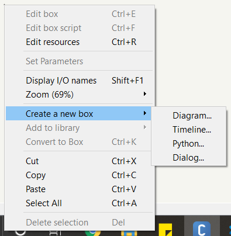
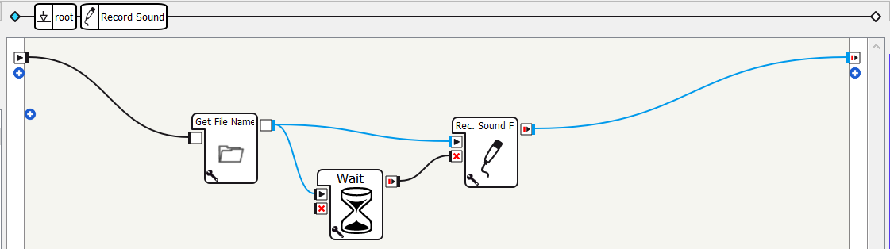

# Core Concepts

This module gives a brief overview of the core concepts / components in a Choregraphe project. The intention of this module is to give the reader a high-level understanding of how a Choregraphe project flows. Daniel Schofield does a great job explaining much of the fundamental concepts of Choregraphe and Pepper on his YouTube channel. I would recommend watching his videos first before continuing with this documentation.

## Reference

Official documentation:

- [Main objects](http://doc.aldebaran.com/2-5/software/choregraphe/main_objects.html)

Watch [this 2-part YouTube video playlist by Daniel Schofield](https://www.youtube.com/watch?v=tqVbX5NWFdU&list=PLmXbV-2dNm43SH6HG88LALwFPs2TQIGpa). The vidoes go over QiChat (used in Dialog boxes) and Python scripts in Choregraphe boxes.

# Boxes

The smallest and most basic unit / component in a Choregraphe project is the box. Each box on the canvas consists of a set of inputs, a set of outputs, and the logic within the box that connects the two. This logic can be Python code, a Dialog script, or more boxes!

To create a box:

- Use a built-in box: find the box in the box library panel and then drag and drop the box onto the canvas
- Create a custom box: right click, hover over "Create a new box", and then choose between Python, Dialog, or Diagram depending on what kind of logic is required

The underlying logic controlling a Python box is (guess what?) Python code. **WARNING: Pepper is running on Python 2.7 and there is no way to install Python 3 nor any Python packages on Pepper! Softbank disallows users from installing anything onto Pepper's on-board computer to prevent any damages or security leaks.** If you explored the box library panel, you may have noticed that Choregraphe has logic boxes (loops, if-clauses, etc.). While it seems tempting to use these boxes in place of Python boxes, it is recommended to try and put all logic within Python boxes instead. By using the built-in boxes, the canvas can get cluttered and become difficult to understand; too many boxes on the canvas. In my opinion, it is better to have a Python box with a large Python script rather than a cluttered canvas. If the developer is expecting complex logic or a functionality a built-in box does not provide, then consider using a Python box.

The underlying logic controlling a Dialog box is QiChat script. At a high-level, QiChat script lets the developer define rules and concepts that structure a conversation between Pepper and the user. Throughout my projects, I use Dialog boxes to define a set of text to listen for and define the corresponding text Pepper should reply with. If the developer expects a dialogue or conversation, then consider using a Dialog box.

When a project begins to get big, the developer may need to start looking at creating diagram boxes. These boxes allow defining the logic using other boxes (nested box logic). Below is the internal logic for the "Record Sound" box.

When there is a need to break up the code into smaller, more manageable components or when designing with reusability in mind, then the developer should consider using diagram boxes. With that in mind, does diagram boxes justify the use of logic boxes rather than Python boxes? If we can minimize the number of boxes on the canvas by moving them into diagram boxes, would that be a better design than large Python scripts? It depends on the application and the logic; ultimately, it becomes the developer's call to decide which makes sense.

NOTE: Timeline boxes are used with animations and animation mode, which is covered in a later module.

# Connectors

Boxes are the smallest and most basic unit / component. When they interact with each other, their capabilities expand. On each box, there should be at least one input slot and one output slot. Hover over each I/O slot to reveal the slot's name. The `onStart` input slot is a special input that represents the box's entrypoint; whatever resources and memory the box needs from the OS is requested. Another special input is the `onStop` input slot, which pre-maturely stops the box and deallocates resources and memory when triggered. On the other hand, the `onStopped` output slot is a special output that represents the box's natural termination; whatever resources and memory the box allocated is deallocated when this output is triggered. Aside from these I/O slots, the developer can define custom I/O slots; each can either behave as a simple I/O or have the same behavior (allocates or deallocates resources and memory) as the mentioned I/O slots.

The entrypoint for the program is always on the left of the canvas while the stopping point is always at the right. To create a connection between one I/O slot to another, simply drag from the output slot to the input slot. Note that it is always good practice to provide at least one route from the entrypoint to the stopping point.

If you continued to explore the box library, you may have noticed that some I/O slots are different colored. These slots are color-coded based on the data type they support:

| Color  | Data Type | Description           |
| ------ | --------- | --------------------- |
| Black  | "Bang"    | Activation signal     |
| Grey   | Dynamic   | Accepts any data type |
| Blue   | String    | Any textual data type |
| Yellow | Number    | Any numeric data type |

**WARNING: Choregraphe will not allow the developer to connect mismatching I/O slots.**
