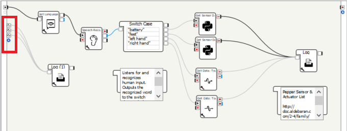

# Retrieving sensor data via the `ALMemory` module

In order to interact with the real world, Pepper has several built-in sensors to collect stimulus. The following [link](http://doc.aldebaran.com/2-5/family/pepper_technical/pepper_dcm/actuator_sensor_names.html) lists out all of Pepper's actuators and sensors. For each, the documentation gives a key-value pair; for example, the [back foot bumper](http://doc.aldebaran.com/2-5/family/pepper_technical/pepper_dcm/actuator_sensor_names.html#switches) has key 'Device/SubDeviceList/Platform/Back/Bumper/Sensor/Value' associated with a switch (on / off) value. For **all the keys** listed on the documentation, their values can be accessed using the `getData(key)` [method](http://doc.aldebaran.com/2-5/naoqi/core/almemory-api.html#ALMemoryProxy::getData__ssCR) in the `ALMemory` module.

## Get Sensor Data

This Choregraphe project is a small project that shows three ways a developer can access sensor data from Pepper: (1) using the _get data_ Choregraphe box, (2) using data memory listeners, and (3) using the `getData(key)` method in a Python Box Script.


1. Choregraphe has a built-in _get data_ Choregraphe box. By providing the actuator's or sensor's key as a parameter, the box will output the associated value when triggered.


2. Choregraphe also includes memory listeners on the Choregraphe project canvas. To see a full list of all built-in memory listeners, browse the memory watcher panel. While the Choregraphe box is triggered by an activation signal, the memory listeners output data when their value changes (like an event listener).




3. The `getData(key)` method in the `ALMemory` module allows developers to access memory data in Python scripts.

## Goals

The Get Sensor Data project demonstrates how to:

- [x] Retrieve readings from all of Pepper's sensors

## Choregraphe Project Canvas


## Challenges

The greatest challenge here was fighting the documentation itself. While all of Pepper's modules and their respective functionalities are recorded in this [documentation](http://doc.aldebaran.com/2-5/naoqi/index.html), finding the functionality needed for a project is difficult. There are not much tutorials going over what each module contains or whether it fits your project's needs; the developer would need to spend much of their time scanning through the API references of candidate modules. This makes developing using Choregraphe boxes all the more appealing, yet it greatly limits the capabilities of Pepper.

## Code

<details><summary>Retrieve Battery Charge Python Box Script</summary>

```python
class MyClass(GeneratedClass):
    def __init__(self):
        GeneratedClass.__init__(self)
        self.mem = ALProxy("ALMemory")
        self.tts = ALProxy("ALTextToSpeech")

    def onLoad(self):
        pass

    def onUnload(self):
        pass

    def onInput_onStart(self):
        # retrieve the sensor data
        data = self.mem.getData('Device/SubDeviceList/Battery/Charge/Sensor/Value')
        data = int(round(data * 100))

        # have Pepper say her battery charge
        self.tts.say('My battery charge is at {} percent!'.format(data))

        # stop the program
        self.onStopped()

    def onInput_onStop(self):
        self.onUnload()
        self.onStopped()
```

</details>

<details><summary>Rertrieve Bumper Toggle Python Box Script</summary>

```python
class MyClass(GeneratedClass):
    def __init__(self):
        GeneratedClass.__init__(self)
        self.mem = ALProxy("ALMemory")
        self.tts = ALProxy("ALTextToSpeech")

    def onLoad(self):
        pass

    def onUnload(self):
        pass

    def onInput_onStart(self):
        # retrieve the sensor data
        left = self.mem.getData('Device/SubDeviceList/Platform/FrontLeft/Bumper/Sensor/Value')
        right = self.mem.getData('Device/SubDeviceList/Platform/FrontRight/Bumper/Sensor/Value')
        back = self.mem.getData('Device/SubDeviceList/Platform/Back/Bumper/Sensor/Value')
        data = {
            'FrontLeft': left,
            'FrontRight': right,
            'Back': back,
        }

        # have Pepper say whether she feels something at her feet
        if data['FrontLeft']:
            self.tts.say('I feel something left of me!')
        if data['FrontRight']:
            self.tts.say('I feel something right of me!')
        if data['Back']:
            self.tts.say('I feel something behind me!')
        if not any([left, right, back]):
            self.tts.say('I don\'t feel anything.')
                
        # stop the program
        self.onStopped()

    def onInput_onStop(self):
        self.onUnload()
        self.onStopped()
```

</details>
