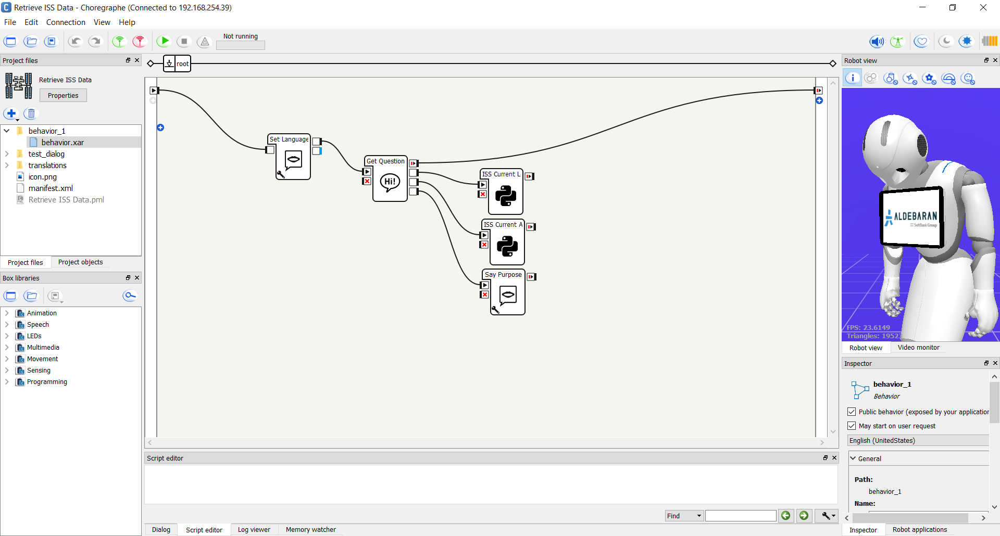

# Testing `requests`

Making REST calls using Python's `requests` package is an important feature to test. Being able to connect to the Internet extends Pepper's capabilities and functionalities. For example, rather than relying on Pepper's built-in speech-to-text services (which only allows developers to set a list of words for pattern matching), developers can instead opt to send audio files to speech-to-text cloud services.

## Retrieve ISS Data

This Choregraphe project is a small project that uses [OpenNotify's API endpoints](http://open-notify.org/) about the International Space Station. It provides a small demonstration of how REST calls can improve Pepper's usability.


## Goals

No goals accomplished

## Choregraphe Project Canvas



## Challenges

One of the biggest challenges when it comes to developing applications for Pepper is that access to the physical robot is almost always required. The developer needs to know that their application actually works with Pepper, not just within their own computers (e.g., using Choregraphe, the Python/C++ SDKs, etc.). For instance, Choregraphe, when not connected with Pepper, has its own installation of Python 2.7 that **does not have the same Python dependencies installed as within Pepper**. This challenge is an easy obstacle to overcome so long as the developer has access to the robot or is developing with the same Python environment.

To check what Python packages are installed on Pepper, you can [access Pepper via SSH](http://doc.aldebaran.com/2-4/dev/tools/opennao.html). The default username and password are both 'nao' assuming these credentials were not changed. Pepper comes equipped with a Linux distribution, so familiarity with the command line is useful; however, Softbank Robotics has **disabled the ability for developers to download and install anything** onto Pepper. Therefore, the developer cannot install new Python dependencies. Instead, these two workarounds from [StackOverflow](https://stackoverflow.com/questions/45799150/pepper-robot-upload-python-modules) and [AboutRobots](http://www.about-robots.com/how-to-import-python-files-in-your-pepper-apps.html) suggest uploading the files for the Python dependency along with the project files, using Python's `os` library to append your uploaded files to Pepper's Python path.

## Code

<details><summary>ISS Current Location Python Box</summary>

```python
class MyClass(GeneratedClass):
    def __init__(self):
        GeneratedClass.__init__(self)
        self.tts = ALProxy('ALTextToSpeech')

    def onLoad(self):
        pass

    def onUnload(self):
        pass

    def onInput_onStart(self):
        # To test Pepper's ability to make REST API calls, we will be using an Open Notify
        # API endpoint for the International Space Station's current location. When the
        # endpoint is hit, it responds with a JSON object.

        # Reference for Open Notify ISS Current Location API
        # http://open-notify.org/Open-Notify-API/ISS-Location-Now/

        # make the API call
        import json
        import requests
        r = requests.get('http://api.open-notify.org/iss-now.json')
        self.logger.info(r)
        data = json.loads(r.text)

        # extract relevant information
        lat = data['iss_position']['latitude']
        lon = data['iss_position']['longitude']

        # make Pepper read the latitude and longitude values
        self.tts.say('The International Spece Station is currently at latitude {} and longitude {}'.format(lat, lon))

        # stop the program
        self.onStopped()

    def onInput_onStop(self):
        self.onUnload()
        self.onStopped()
```

</details>

<details><summary>ISS Current Astronauts Python Box</summary>

```python
class MyClass(GeneratedClass):
    def __init__(self):
        GeneratedClass.__init__(self)
        self.tts = ALProxy('ALTextToSpeech')

    def onLoad(self):
        pass

    def onUnload(self):
        pass

    def onInput_onStart(self):
        # To test Pepper's ability to make REST API calls, we will be using an Open Notify
        # API endpoint for the International Space Station's current astronauts. When the
        # endpoint is hit, it responds with a JSON object.

        # Reference for Open Notify ISS Current Location API
        # http://open-notify.org/Open-Notify-API/People-In-Space/

        # make the API call
        import json
        import requests
        r = requests.get('http://api.open-notify.org/astros.json')
        self.logger.info(r)
        data = json.loads(r.text)

        # extract relevant information
        num = data['number']
        people = data['people']

        # make Pepper read the latitude and longitude values
        self.tts.say('The International Spece Station currently has {} astronauts.'.format(num))

        # stop the program
        self.onStopped()

    def onInput_onStop(self):
        self.onUnload()
        self.onStopped()
```

</details>

## References

As of Summer 2020, these are the packages installed on Pepper:

```
$ pip freeze
```

```
Pillow==3.1.1
PyYAML==3.10
TornadIO2==0.0.3
catkin==0.6.14
chardet==2.2.1
dnspython==1.9.4
gencpp==0.5.3
genlisp==0.4.15
genmsg==0.5.6
genpy==0.5.4
numpy==1.8.0
pil-compat==1.0.0
pycrypto==2.6.1
pycurl==7.19.0
pyserial==2.7
python-dateutil==2.1
pyxattr==0.5.2
requests==2.5.1
roslz4==1.11.13
sensor-msgs==1.11.8
sh==1.09
simplejson==3.3.0
six==1.3.0
tornado==3.1.1
vobject==0.8.1c
wsgiref==0.1.2
xmpppy==0.5.0-rc1
```
