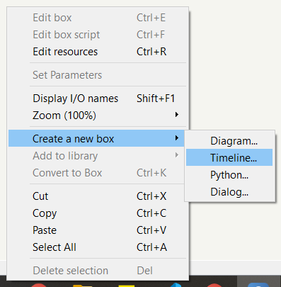
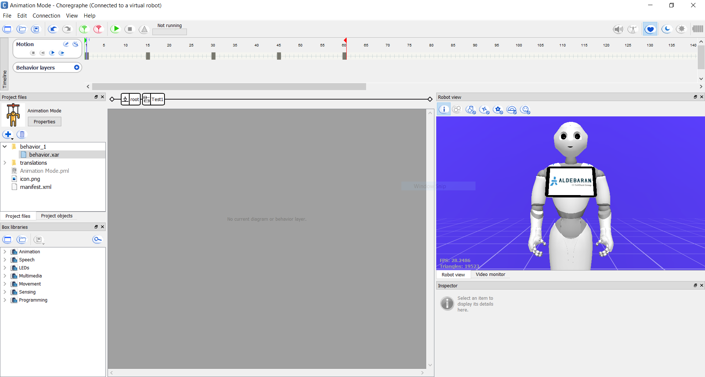
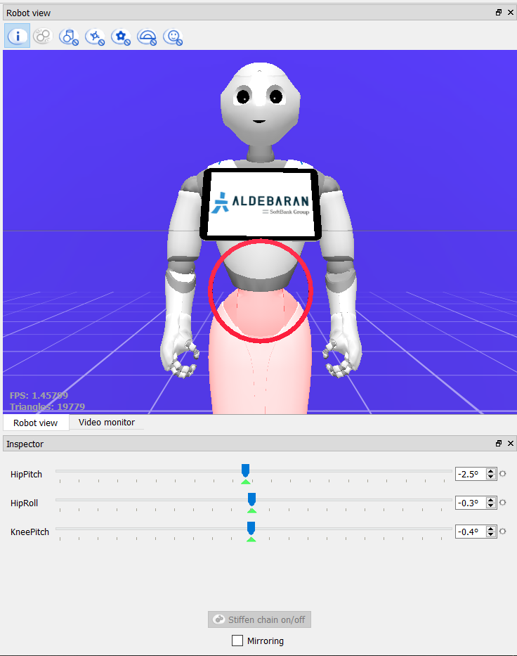

# Animation

Rather than sending commands to the actuators themselves, developers can take advantage of animation mode instead to create movements and gestures. It would be difficult to manually send values to each actuator; it is better to abstract function calls with computer animations.

Official documentation:

- [Timeline](http://doc.aldebaran.com/2-4/software/choregraphe/panels/timeline_panel.html)

## Animation Mode

This is a very small Choregraphe project that shows how to create timeline boxes and create animations.



A timeline boxes' internal logic looks like the below image:



Underneath the header is the time ruler where keyframes are created by the developer. If you have taken an animation course, then you might be familiar with keyframes. In traditional animation, each frame is drawn by animators to create the illusion of movement when displayed in series. With the help of computers, animators only need to define keyframes and the frames in between are computed by the computer.

Underneath the time ruler are the behavior layers. Aside from the movements and gestures, timeline boxes can also have internal logic (e.g., saying something) that runs parallel with the animation.

With Choregraphe, there are two ways of setting the keyframes:

- Use stiffness-control commands as described by the official documentation: [Animation Mode](http://doc.aldebaran.com/2-4/software/choregraphe/animation_mode.html)
- Click any joint in Choregraphe's robot view panel and adjust each actuator's values in the inspector panel.



## Goals

- [x] Send commands to all of Pepper's actuators

## Challenges

When I first attempted animation, I attempted to use the stiffness-control commands. By entering animation mode (at the top right corner in Choregraphe), the remotely controlled Pepper robot can be physically moved. Once the desired keyframe has been achieved, you could then tap his head to set the keyframe (although I have had difficulty setting keyframes this method).

Although I followed [the documentation](http://doc.aldebaran.com/2-4/software/choregraphe/animation_mode.html), Pepper's autonomous life still gives me trouble when animating via stiffness-control commands. Even after turning off autonomous life, Pepper's head continues to turn her head to keep eye contact with me. This is a problem... especially when trying to animate her head.

My current workaround is, before setting the keyframes:

1. [Access Pepper via SSH](http://doc.aldebaran.com/2-4/dev/tools/opennao.html)
2. Go into the Python shell
3. Enter the following lines:

```python
import naoqi
from naoqi import ALProxy
al = ALProxy("ALAutonomousLife", "192.168.254.39", 9559)
al.stopAll()
```

This should then stop Pepper's autonomous head turning.
