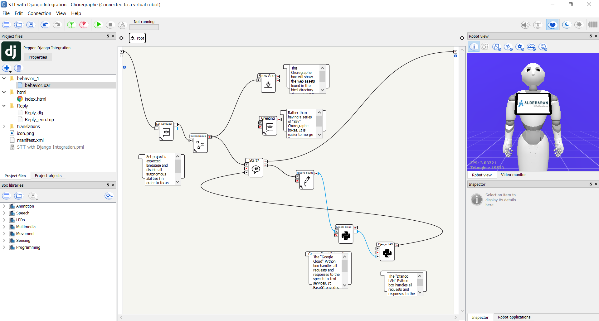

# Tablet

To display content on the tablet, the developer would use the "Show App" Choregraphe box in the Multimedia > Tablet box library.

The web application that Pepper shows on her tablet is the web assets included in the `html` directory in the project files panel. Each web application must include an `index.html` HTML file as an entrypoint for the application. Within the same directory, the developer could include another directory called `assets` (or any other name) for CSS, JavaScript, and other static files like pictures, videos, etc.

## Goals

- [x] Displaying images, videos, etc. on Pepper's tablet
