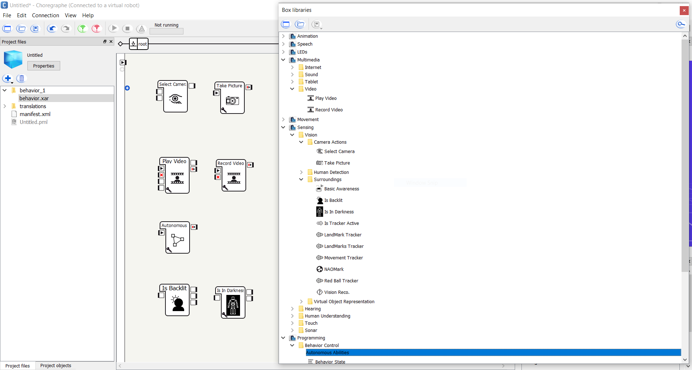

# Cameras

Pepper is equipped to record both audio and video. In `4-enhancing-stt-capabilities`, I showed you how to record audio and transcribe it to text. This module describes the Choregraphe boxes that make picture and video taking possible. These boxes are shown below:

> Project Idea: Maybe a project that uses Pepper to take pictures and record videos, sending them to a Django backend for storage? Then, in a gallery or YouTube-esque interface, show these on a webpage.

## Challenges

There are a few challenges when working with Pepper's cameras.

### Camera and Microphone Placement

Pepper's microphones and cameras are placed close to her head, where her onboard computer lives. As a result, any audio or video will capture background noises emitting from the computer (a subtle whirring). This should be taken into consideration when using Pepper's microphones and cameras.

### Autonomous Life

Depending on what autonomous abilities are activated, Pepper may move around on her own and accidentally disrupt the audio / video capturing process.

### Lighting

As you may have already noticed, if you check the `Video monitor` tab of the robot view panel, lighting is a serious issue. In poor lighting, video and pictures may come out too dark or too light; its effects even influence Pepper's autonomous abilities. Under poor lighting, Pepper may react to stimulus - shadows, slight changes in lighting, etc. - that makes her move and behave awkwardly (looking and scanning the ceiling, jerking her head around, etc.). To workaround this issue, it is recommended to find good indoor lighting or use outdoor lighting.

## Goals

- [x] Get images and videos from Pepper's camera(s)
